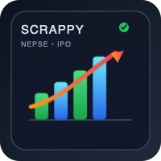

<p align="center">
	
</p>

# Scrappy

Scrappy is a Python project that collects NEPSE market and IPO data in a clean, ML-friendly format for downstream analysis and automation.

## What it collects

- Market snapshots to CSV:
	- `data/nepse/YYYY/MM/market_summary_YYYY-MM-DD.csv`
	- `data/nepse/YYYY/MM/today_price_YYYY-MM-DD.csv`
- IPO feed to JSON:
	- `data/ipo/ipo_feed.json`

## Sources

- NEPSE (primary): https://www.nepalstock.com/
- Merolagani IPO pages (IPO): https://merolagani.com/
- ShareSansar live table (fallback): https://www.sharesansar.com/
- NepseLink IPO opening table (IPO): https://nepselink.com/ipo-opening

## Setup

Create and activate a virtual environment:

```bash
python3 -m venv .venv
source .venv/bin/activate
python -m pip install --upgrade pip
python -m pip install -e ".[dev]"
```

## Run jobs

```bash
# market only
python -m scraper.cli market

# ipo only
python -m scraper.cli ipo

# both
python -m scraper.cli all
```

## Dev workflow

```bash
source .venv/bin/activate && python -m pip install -e ".[dev]" && pre-commit install && pre-commit run --all-files
```

Install and enable git hooks for pre-commit checks:

```bash
pre-commit install
pre-commit run --all-files
```

After `pre-commit install`, every commit will automatically run lint, formatting, and tests (`pytest -q tests`).

Manual quality checks:

```bash
ruff check .
black --check .
pytest -q tests
```
